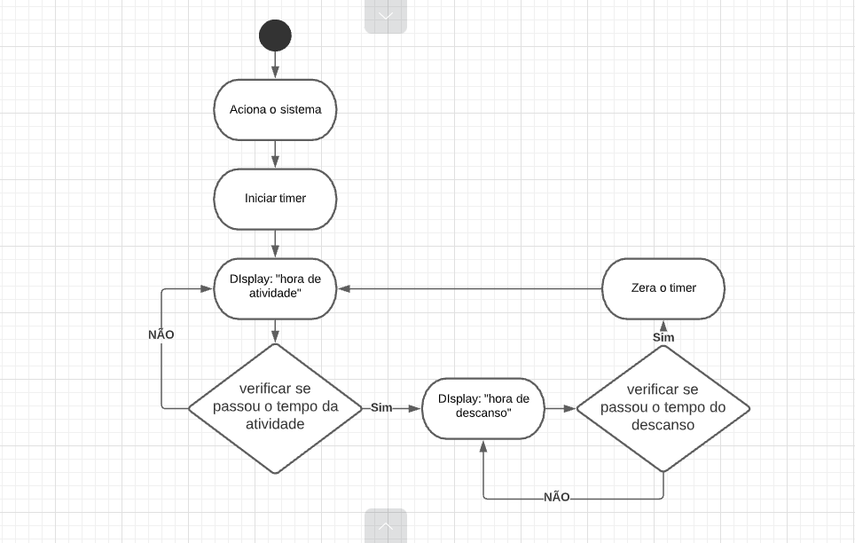

# Trabalho_software

Trabalhinho topzão Pomodoro

## Concepção:

* O público que visamos atingir são aqueles que buscam ter uma maior produtividade. Com ele o gerenciamento do tempo 
  utilizado é aperfeiçoado, facilitando a organização do usuário para começar e finalizar atividades do dia a dia. 
* O software vai controlar o tempo de trabalho, 25 minutos, e o de descanso, 5 minutos, do usuário emitindo um aviso 
  no display. 

## Levantamentos: 
 
* Ao final do projeto visamos obter um pomodoro que mande uma notificação a cada 25 minutos de trabalho intervalado por 
  outros 5 minutos de descanso (que ao final deste intervalo também notifica que o tempo de descanso acabou). 
* Expectativas: fazer um código limpo, simples e que entregue o que o projeto propõe. Objetivos prioritários: sermos 
  capazes de recriar o pomodoro a sua forma tradicional, com 25 minutos em que o usuário se dedicara a uma atividade e 
  5 minutos de descanso. 
* Expectativas do gerente de projeto: entregar um produto que cumpra os requisitos desejados, recriar o pomodoro. 
* Expectativas da equipe desenvolvimento: aprofundar os conhecimentos da equipe em Python e Micropython. 
* [link_para_projeto](micropython.py)

## Sprints

### Reunião de 10/10/2021 

* **Descrição** Estima-se que em cinco dias seja possível o estudo da biblioteca "time" e "framebuf", posteriormente
  seguindo para a construção do temporizador e template dos displays. 
* **Prazo para entrega** 16/10/2021
* **Pós-Reunião** Facilmente concluído no tempo estipulado (13/10/2021), com êxito nas tarefas apresentadas, entretanto 
  foi necessário o estudo e aplicação da biblioteca "machine" para o funcionamento do código. O tempo restante será 
  utilizado para adiantar o resto do trabalho.

### Reunião de 13/10/2021

* **Descrição** Estima-se que em até sete dias seja possível a junção dos códigos dos displays junto ao temporizador. 
* **Prazo para entrega** 20/10/2021
* **Pós-Reunião** Foi percebido certa dificuldade na organização do script. Apesar dos obstáculos encontrados, conseguimos 
  finalizar no tempo estipulado, e ainda foi implementada a funcionalidade que mostra o ciclo do Pomodoro, juntamente de 
  uma otimização geral do código. Finalizado em 18/10/2021.

## Diagrama UML:

